#cubic

archive of an art project on symmetry.

##about

A grain of fun!

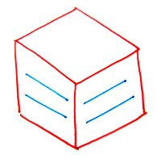

Cubic by Chinnee is a little fun project by 2 friends.

Can symmetry exist through space?
Can a connection be made despite the distance?
Can the same message be conveyed from 2 different places?
Cubic will explore these questions.

Each post will have 2 pictures from 2 corners of the world with a little Haiku. 
But they will say the same message.

Can you decipher it?

##symmetries

1. **Notebook** *4th October 2009 - 08:00PM*
	
	> A new journey starts
	
	> Singapore and Gothenburg
	
	> A sweet grain of fun!
	
	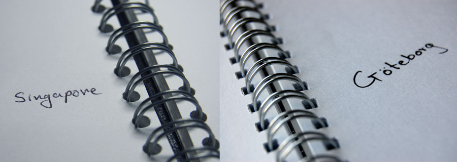
- **Waterfront** *14th October 2009 - 06:23AM*

	> City by the river
	
	> Looking far as the day goes by
	
	> Cool water and bright sky
	
	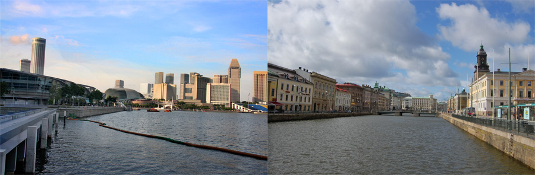
- **Campus** *18th October 2009 - 07:52PM*

	> Walking through the school
	
	> Colours and shapes on floors and walls
	
	> Learning circles abound
	
	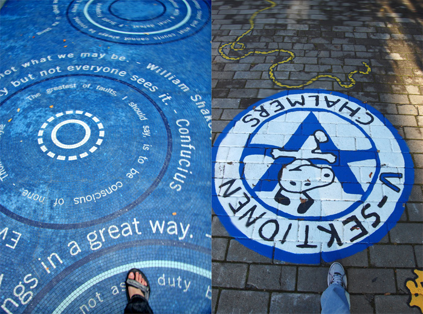
- **Charting** *1st November 2009 - 07:22PM*

	> Bunch of graphs and tables
	
	> Cracking our heads for projects
	
	> Learning's always fun
	
	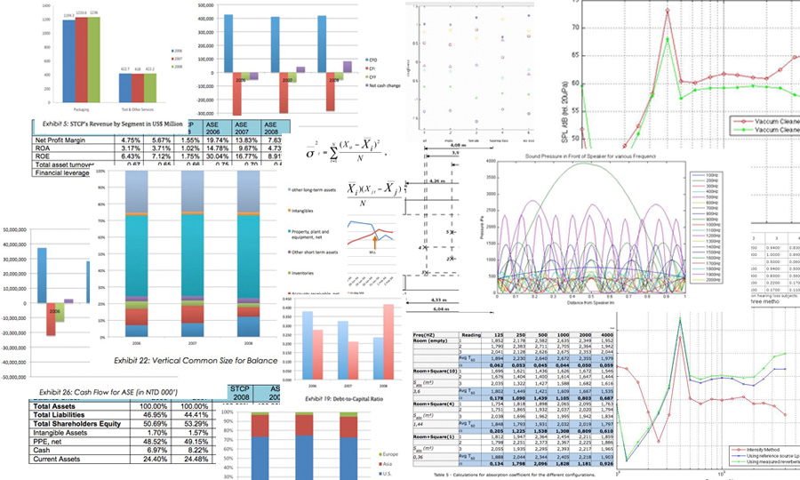
- **Silver Balls** *26th December 2009 - 12:21AM*

	> Trees, balls, wreaths and cakes
	
	> Carols, warm lights, Santa and glogg
	
	> Merry Christmas day
	
	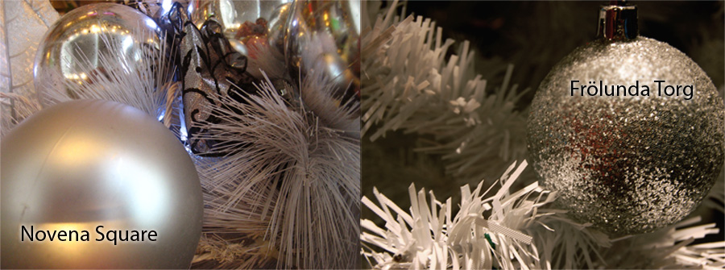
- **Library** *3rd January 2010 - 09:00AM*

	> Tomes of great knowledge
	
	> Precious gifts for the next gen
	
	> But will paper survive?
	
	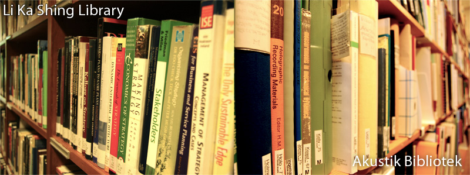
- **Manhole** *2th January 2010 - 10:00AM*

	> When you look down
	
	> Manhole covers square and round
	
	> Leading us underground
	
	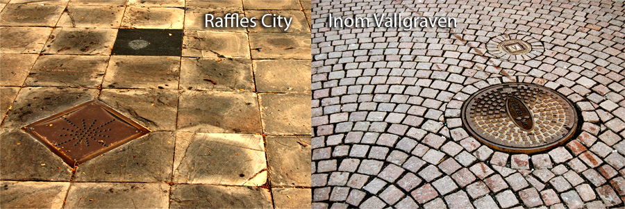
- **Ceilings** *25th January 2010 - 10:00AM*

	> Domes on the ceilings
	
	> of churches and other buildings
	
	> A reason to look up
	
	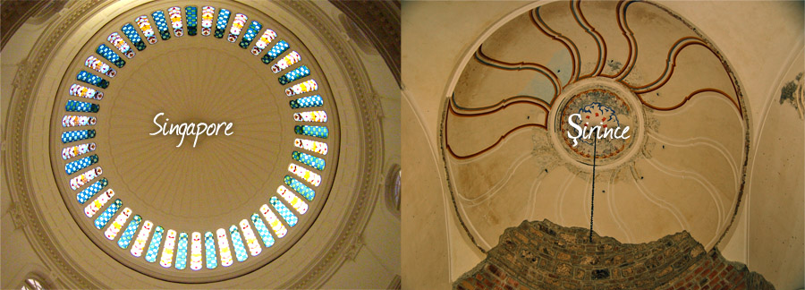
- **Perspective** *14th February 2010 - 10:25PM*

	> Buildings near or far
	
	> A matter of perspective
	
	> Like life's ups and downs
	
	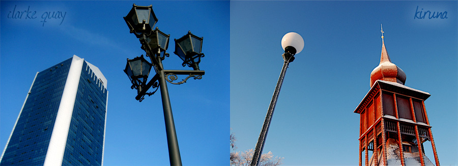
- **TedX** *21st February 2010 - 12:10AM*

	> Ideas worth Spreading
	
	> Now for you, me and everyone
	
	> Start you're own TEDx
	
	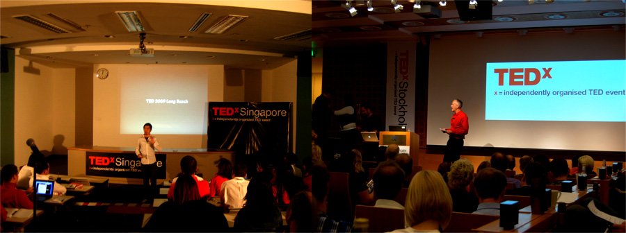
- **Tower** *1st June 2010 - 11:57PM*

	> Places of worship
	
	> Different from outside, but inside,
	
	> Calm, Peace and Happiness
	
	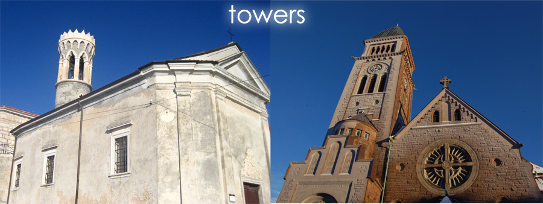
- **Rice and Spice** *18th January 2011 - 11:30PM*

	> Seafood, rice and spice,
	
	> Food round the world is a joy,
	
	> Turkey or Japan	
	
	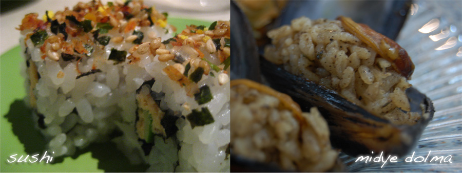
- **Frozen liquid** *25th January 2011 - 09:00AM*

	> Cities on water,
	
	> How they freeze in the winter,
	
	> Perfect for a stroll
	
	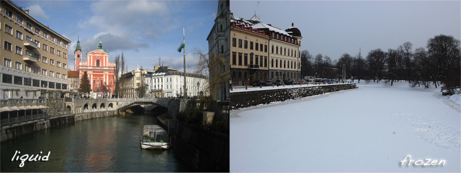
- **Southpark** *2nd February 2011 - 08:24PM*

	> Southpark looks at life
	
	> With Eric,Stan,Kenny,Kyle
	
	> Shall we do it too?
	
	
- **Sea and Snow** *22nd March 2011 - 11:19PM*

	> Blue sea and white snow
	
	> Sunny and warm or icy cold
	
	> Both made of water
	
	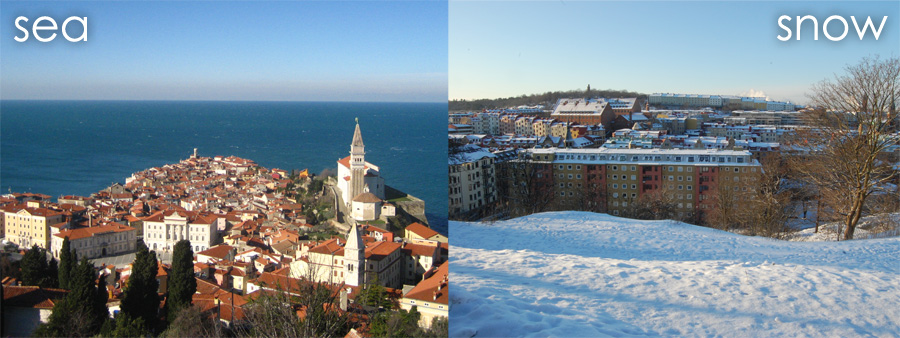
- **Towers** *28th March 2011 - 11:22PM*

	> Tower on churches
	
	> Hold tales of many cultures
	
	> Rich, deep and intriguing
	
	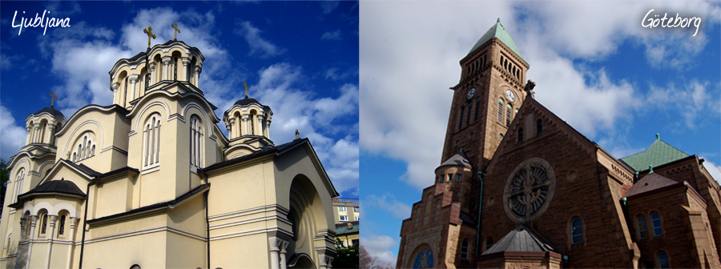
- **Books** *6th June 2011 - 09:27AM*

	> Hearing and Seeing
	
	> Used to know the world around
	
	> Yet so much unknown
	
	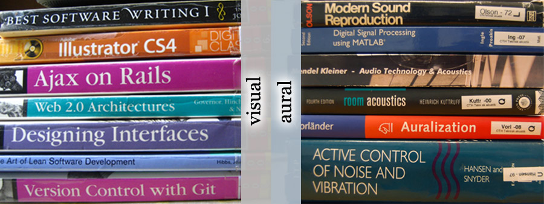
- **Lens & Pics** *7th July 2011 - 05:14PM*

	> Photos- what's the point?
	
	> The eye sees what lens doesn't
	
	> Memories lie within
	
	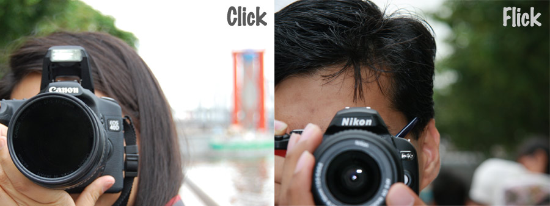
	
##license

All content on is licensed under [Creative Commons](http://creativecommons.org/licenses/by-nc-sa/3.0/sg/).